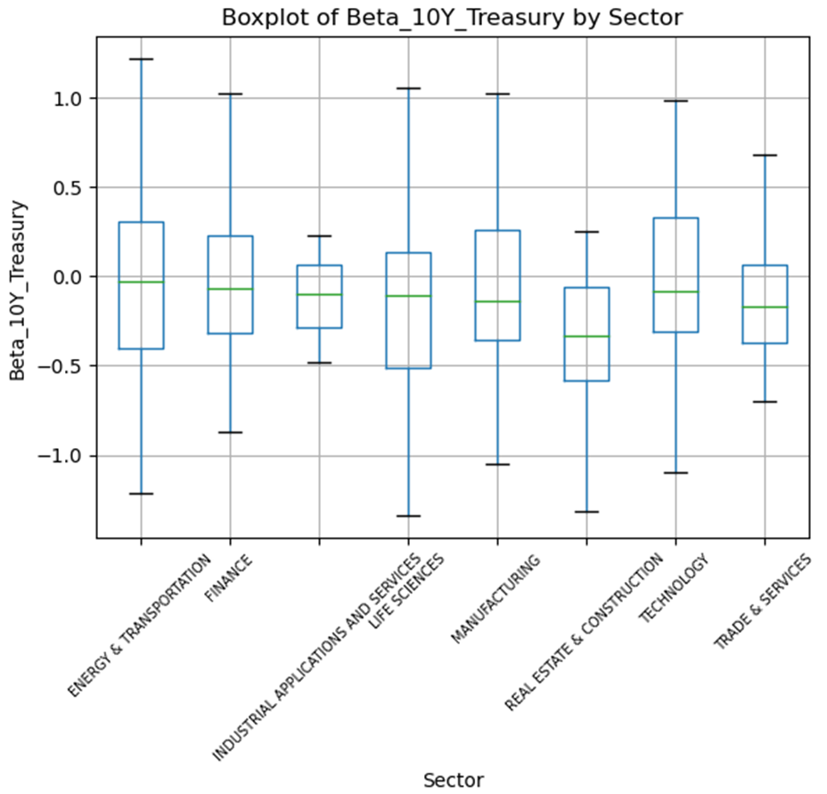

### Regression on Price Sensitivity

Conducted regression analysis examining relationship between weekly 10-year treasury yield changes and equity returns

Data range: from 2024-01-01

Opportunity:
-Invest in low-sensitivity stocks when rising rates

Intersting insights
- Financial sector seem to have adapted to the "Higher-for-longer" interst rate environment
- Surprisingly, compared to other sectors, they have a low sensitivity, they may have found a new equilibrium to benefit from high interest rate  
